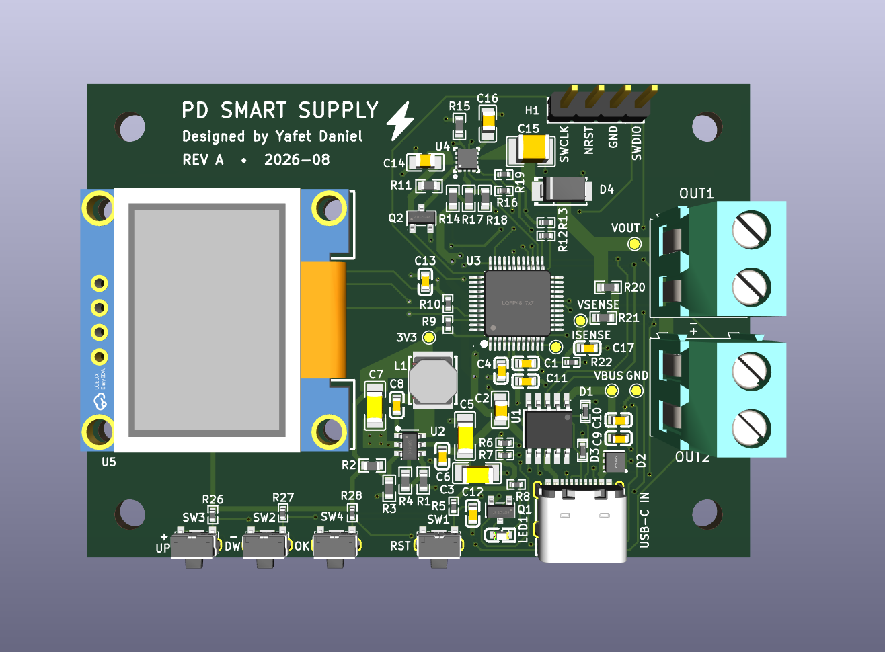
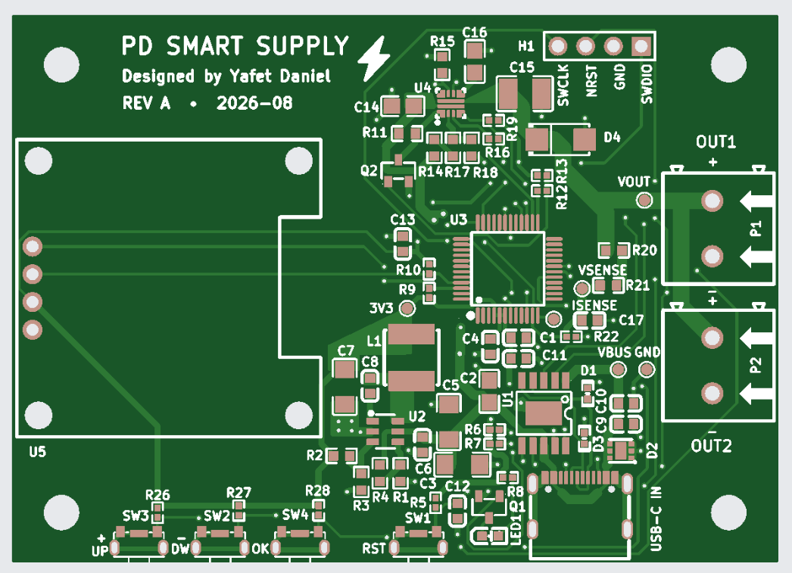

# PD Smart Supply

A USB-C Power Delivery supply designed by Yafet Daniel. Rev A uses an STM32 controller to select a PD voltage, control a protected output, and measure output voltage and current. An OLED and three pushbuttons provide the user interface.

## Specifications

| Parameter | Design specification |
|---|---|
| Input | USB-C Power Delivery through a CH224A controller |
| Output voltage selections | 5 V, 9 V, 12 V, and 20 V |
| Rated output | Up to 3 A total, 60 W at 20 V |
| Output connectors | Two parallel screw terminals sharing one protected output |
| Controller | STM32G071CBT6 |
| Output protection | TPS259470L eFuse with MCU shutdown and fault monitoring |
| Hardware current limit | Approximately 3.76 A nominal; rated output remains 3 A |
| Monitoring | Output voltage and current sensing through the MCU ADC |
| User interface | I²C OLED, Up/Down/Select buttons, and PD status LED |
| Internal power rail | 3.3 V from a TPS560430 buck converter |
| Debug interface | SWD |
| PCB | 70 × 50 mm, four layers, nominal 1.6 mm thickness |

Available output voltages and power depend on the connected PD source and cable. Voltage selection uses discrete PD requests; the design does not provide continuously variable voltage or programmable constant-current regulation. The two outputs share the 3 A rating. The design excludes 15 V and 28 V operation.

## Hardware

The USB-C input feeds the protected output through the eFuse. A separate buck converter powers the controller and interface from the negotiated input voltage. The hardware includes VBUS transient protection, output overvoltage cutoff, controlled startup, and voltage/current test points.

## Project status

The Rev A schematic and four-layer PCB layout are complete and prepared for manufacturing. The repository includes a generated STM32CubeIDE project configured for a 64 MHz system clock, ADC voltage and current sensing, I²C, control and status GPIO, and SWD debugging. PD selection logic, display operation, button handling, and application fault handling remain to be implemented. The ratings above are design targets, not measured performance results.

## Repository contents

- `PD Smart Supply.kicad_pro`, `.kicad_sch`, and `.kicad_pcb`: KiCad project, schematic, and board layout.
- `PD Smart Supply.kicad_dru`: project-specific PCB design rules.
- `Firmware/`: STM32CubeMX configuration, STM32CubeIDE project files, generated firmware sources, and device libraries.
- `Docs/PD_Smart_Supply_Rev_A_Design_Record.pdf`: design record.
- `Docs/Sim/`: LTspice eFuse enable/shutdown simulation.
- `Docs/images/`: PCB layout and 3D render images.

Open `PD Smart Supply.kicad_pro` in KiCad 9 to inspect the hardware. Custom libraries and manufacturer references under `Lib/` and `Docs/Ref/` are excluded from Git, so library paths may need to be restored for editing. Open `Firmware/Firmware.ioc` in STM32CubeMX or import `Firmware/` into STM32CubeIDE to inspect or regenerate the firmware project.
